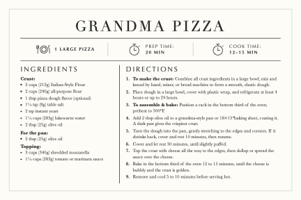

# Recipes

A collection of family recipes, written as small markdown files that render into
printable **4×6 recipe cards** — sized to print on standard 4×6 index cards.



## Layout

- `anthony/` — Anthony's recipes
- `clare/` — Clare's recipes
- `skills/recipe-card/` — the tooling that turns a recipe `.md` into a card PDF

Each recipe is one markdown file with frontmatter (title, servings, prep/cook
times, optional attribution) plus `## Ingredients` and `## Directions` sections.

## Making a card

The `recipe-card` skill renders a recipe to a 4×6 landscape PDF via a small
Python script. From the repo root:

```bash
python3 skills/recipe-card/recipe_card.py anthony/grandma_pizza.md
```

This writes `grandma_pizza.html` and `grandma_pizza.pdf` next to the markdown.
**Print the PDF at actual size (100% / no scaling) onto a 4×6 index card** — the
page is defined as exactly 6×4 inches, so it maps one-to-one to the card.

See `skills/recipe-card/SKILL.md` for the full markdown format, fitting
guidance, and how the rendering works.

## A note on fit

The whole recipe has to fit on a single 4×6 card, so the cards are intentionally
concise — long headnotes, variations, and storage tips are trimmed. Recipes with
a substantial sub-step (a stock, a roux) are split into separate cards that
reference each other (e.g. Sunday Gravy → Tomato Gravy + Meatballs).
